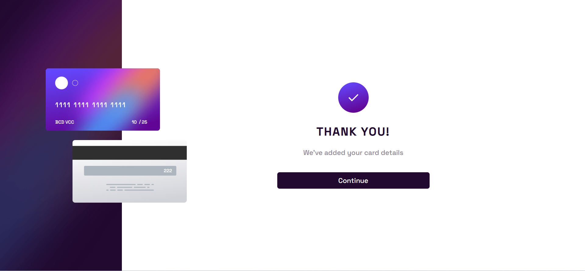

# Frontend Mentor - Interactive card details form solution

This is a solution to the [Interactive card details form challenge on Frontend Mentor](https://www.frontendmentor.io/challenges/interactive-card-details-form-XpS8cKZDWw). Frontend Mentor challenges help you improve your coding skills by building realistic projects.

## Table of contents

- [Overview](#overview)
  - [The challenge](#the-challenge)
  - [Screenshot](#screenshot)
  - [Links](#links)
- [My process](#my-process)
  - [Built with](#built-with)
  - [What I learned](#what-i-learned)
  - [Continued development](#continued-development)
  - [Useful resources](#useful-resources)
- [Author](#author)
- [Acknowledgments](#acknowledgments)

## Overview

### The challenge

Users should be able to:

- Fill in the form and see the card details update in real-time
- Receive error messages when the form is submitted if:
  - Any input field is empty
  - The card number, expiry date, or CVC fields are in the wrong format
- View the optimal layout depending on their device's screen size
- See hover, active, and focus states for interactive elements on the page

### Screenshot




### Links

- Live Site URL: [Interactive card at Vercel](https://interactive-card-details-form-gamma.vercel.app/)

## My process

### Built with

- Semantic HTML5 markup
- CSS custom properties
- CSS Box Model
- Mobile-first workflow
- JavaScript

### What I learned

In this project, I used mobile first approach to build the design. It was easier than the previous ones, adapting from small to bigger screen is easier than the opposite. Furthermore, I used CSS position options to display things where I wanted.

```css
.background {
  background: url('../images/bg-main-mobile.png');
  position: fixed;
  top: 0;
  width: 100%;
  height: 240px;
}

.card {
  width: 350px;
  position: relative;
  margin: 0 auto;
}

.card-back {
  position: absolute;
  width: 300px;
  top: 30px;
  right: 0;
}
```

I tried to avoid code duplication developing a generic function to validate user inputs:

```js
const genericValidation = (name, value, condition, input, info) => {
  if (condition) {
    input.style.borderColor = 'hsl(0, 100%, 66%)';
    info.textContent = 'Invalid ' + name;

    if (!value.length) {
      info.textContent = "Can't be blank";
    }
  } else {
    input.style.borderColor = 'hsl(270, 3%, 87%)';
    info.textContent = '';
  }
};
```

### Continued development

In the next project, I will use more of css size units and transitions. I am not very confortble with them yet, but I will explore them a lot.

### Useful resources

- [CSS - The Complete Guide 2023](https://www.example.com) - This is an amazing CSS course that I'm doing to improve my skills.
- [Check if a String Contains Only Numbers in JavaScript](https://codingbeautydev.com/blog/javascript-check-if-string-contains-only-numbers/#:~:text=September%205%2C%202022-,To%20check%20if%20a%20string%20contains%20only%20numbers%20in%20JavaScript,Otherwise%2C%20it%20will%20return%20false%20.) - This is an article which helped building the Regex to validate the card number.

## Author

- LinkedIn - [Winstein Martins](https://www.linkedin.com/in/winstein-martins/)
- Frontend Mentor - [@winstein27](https://www.frontendmentor.io/profile/winstein27)
